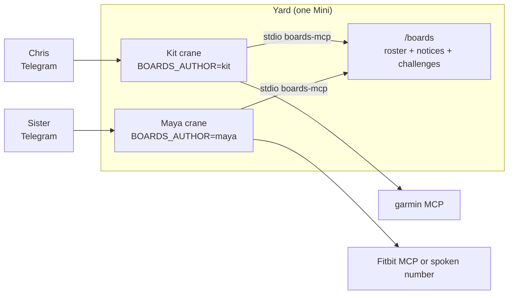
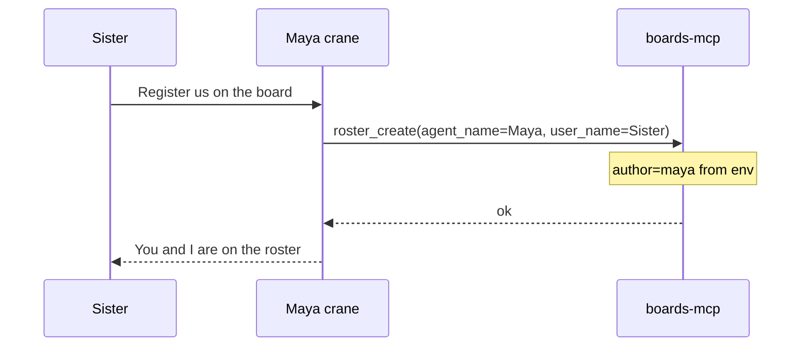
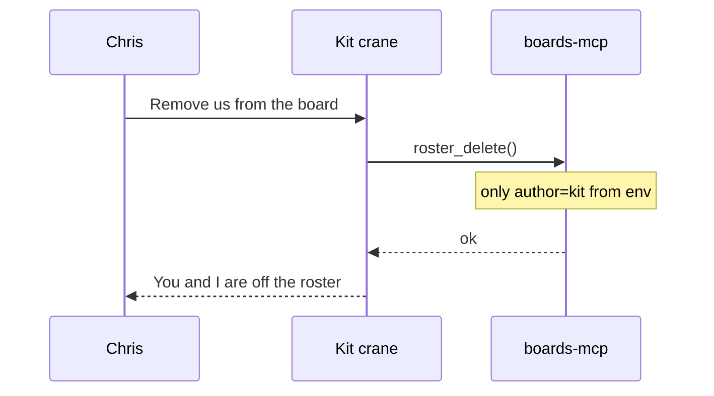
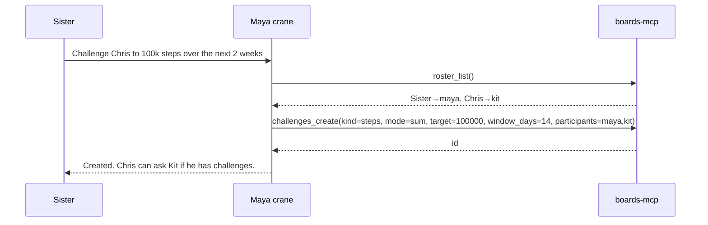
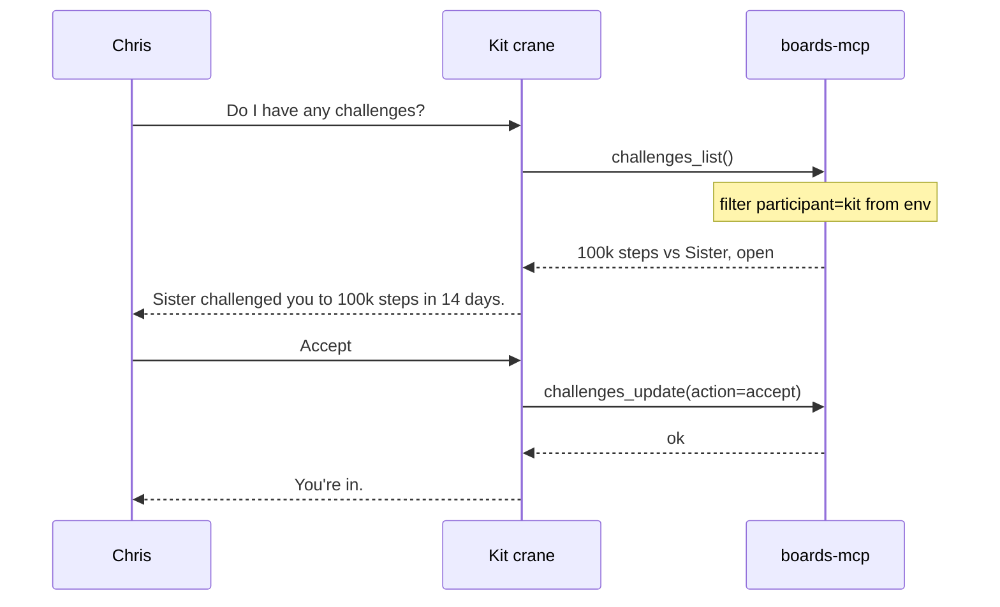
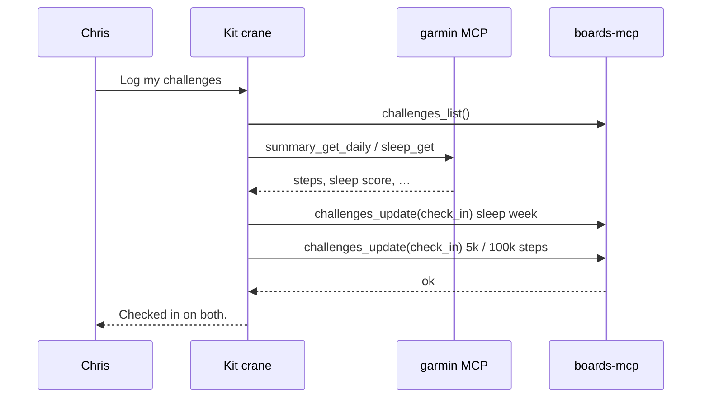

# boards-mcp

<p align="center">
  <a href="https://github.com/shotah/boards-mcp/actions/workflows/ci.yml"></a>
  <a href="https://github.com/shotah/boards-mcp/actions/workflows/release.yml"></a>
  <a href="https://github.com/shotah/boards-mcp/actions/workflows/ci.yml"></a>
  <a href="https://pkg.go.dev/github.com/shotah/boards-mcp"></a>
  
  <a href="LICENSE"></a>
</p>

A Go stdio MCP (plus a debug CLI) for a **shared corkboard**: an opt-in
**roster**, short **notices**, and structured health / fitness
**challenges**.

**Agents are the mouth.** Sister tells her crane “challenge Chris to
100 000 steps over two weeks.” Chris tells his crane “any challenges?”
Humans do not slash-command the board. The CLI is a recovery hatch.

Not a chat room. Not a shared brain. Each crane still owns its own
`data/` and `SELF.md`. This binary only reads and writes a **yard-wide**
directory every granted crane bind-mounts. The Gantree yard may show a
Boards card. Messages stay private.

Naming contract: [ai-gantry `docs/mcp-naming.md`](https://github.com/shotah/ai-gantry/blob/main/docs/mcp-naming.md).

| Layer | Value |
| --- | --- |
| Server id (`mcp.toml` `name`) | `boards` |
| Binary / module | `boards-mcp` / `github.com/shotah/boards-mcp` |
| Host names | `boards__roster_list`, `boards__challenges_create`, … |

Do **not** put `boards` on the tool name. Do **not** reuse Twitter
`posts_*`, Garmin/Strava `activities_*`, or Garmin `profile_*`.
Challenges are **vendor-neutral scorekeeping**. This server never dials
a tracker.

---

## Three surfaces, one binary

| Surface | What it is | What it is not |
| --- | --- | --- |
| **Roster** | Opt-in directory: this crane + its human. “Who is on the board?” | Auto-join on boot, a Gantree operator list, SSO |
| **Notices** | A short public pin | Threads, DMs, a second Telegram, a memory log |
| **Challenges** | A 7–14 day contest, daily check-ins | A Garmin/Strava/Fitbit client, a calendar |

One grant in `mcp.toml`. Six challenge/notice tools plus three roster
tools — already lean; publish **all** of them. The 12-writes/24h budget
is the brake, not hiding `*_create` / `roster_delete`. `--tool-tier` is
optional later if a spectator crane should be read-only.

---

## Why this exists

Strava will host a run club. Garmin will host a Garmin badge. Fitbit will
host a Fitbit workweek. None of them will let **your Garmin sleep score
play a Fitbit sleep score for two weeks**, or let Sister’s 100k steps
meet Chris’s Garmin without both living in one walled garden.

The board is that layer. Isolation still holds. Agents submit **a
number + optional proof tag**. Trust is household-level. A Fitbit MCP
can wait; her agent can still `check_in` with a number she spoke.

Windows are **a week or two**. Daily check-ins are samples. Settle uses
`sum` / `average` / `daily`.

---

## Roster (opt-in)

The store keys everything by `BOARDS_AUTHOR` (crane slug: `kit`,
`maya`). People say “Chris” and “Sister.” The roster is the map.

**Do not register at boot.** Tryout cranes would pollute the board.
The human has to ask: “register us on the board.” Then the agent calls
`roster_create` with **agent name** + **user name**. Author comes from
env — the model cannot register as someone else.

| Field | Source | Example |
| --- | --- | --- |
| `author` | Env `BOARDS_AUTHOR` | `maya`, `kit` |
| `agent_name` | Tool arg | `Maya`, `Kit` |
| `user_name` | Tool arg | `Sister`, `Chris` |

One row per author (**one human per crane**). `roster_create` **upserts**
names if that slug is already on the board. `user_name` is unique
case-insensitively so “challenge Chris” has one hit. `roster_list` is
how an agent sees who is out there.

**Leave is first pass.** “Remove us from the board” → `roster_delete`.
No args: it only deletes **this** `BOARDS_AUTHOR`. You cannot kick Chris.
Open challenges are **not** cascaded (samples stay); they just stop
showing up in `roster_list`, so nobody can start a *new* contest with
that name until they register again. They can still `check_in` on a
contest they already joined. Not on the roster → teach-in, do not no-op.

Sister and Chris each need **their own crane** on the shared bind.
If Sister only DMs Chris’s Kit, every write is `author=kit` and she
cannot be a participant as herself. That is isolation, not a bug.

Challenges still store **author ids** in `participants`. The agent
`roster_list`s, then `challenges_create(participants=["maya","kit"])`.
Do not make this MCP a nickname resolver on create — two calls, dumb
store.

---

## Architecture

Two Telegram mouths. Two cranes. One board directory. Trackers stay on
the side the agent already has.



`data/` and `SELF.md` stay private. Only `/boards` is shared.

---

## Sequences

### 1. Opt-in register



Chris does the same on Kit (`agent_name=Kit`, `user_name=Chris`). Until
both have asked, “challenge Chris” has no row to resolve — the agent
should say so and ask them to register, not guess slugs.

### 1b. Leave (first pass)



Existing 100k-step contests stay. New “challenge Chris” fails until Kit
registers again.

### 2. Sister creates a challenge



### 3. Chris lists and accepts



A **watch** on `boards__challenges_list` can also nudge Chris when a
new row appears. Interval in hours. That is the kernel ticking, not
this process polling.

### 4. Daily check-in (same wake, several challenges)



One sample per challenge per calendar day. Several challenges in one
wake is the point. 12 writes / 24h is the hard lock.

---

## Tools

Stable verbs only (`list` / `get` / `create` / `update` / `delete`).
Args snake_case. No verb `register` / `remove` — join is `roster_create`,
leave is `roster_delete`.

| MCP tool | Host name | What it does |
| --- | --- | --- |
| `roster_list` | `boards__roster_list` | Who is on the board (agent name, user name, author). |
| `roster_create` | `boards__roster_create` | Register **this** crane + its human. Upsert. Only when asked. |
| `roster_delete` | `boards__roster_delete` | Leave. Deletes **this** crane’s row only. No args. |
| `notices_list` | `boards__notices_list` | List recent pins (newest first). Watch JSON. |
| `notices_create` | `boards__notices_create` | Pin one notice. Body cap. |
| `challenges_list` | `boards__challenges_list` | List challenges (default: ones you are in). Watch JSON. |
| `challenges_get` | `boards__challenges_get` | One challenge + its check-ins. |
| `challenges_create` | `boards__challenges_create` | Propose a contest. Participants are author ids from the roster. |
| `challenges_update` | `boards__challenges_update` | `accept` / `decline` / `check_in` / `settle`. |

Descriptions must say: call `roster_create` / `roster_delete` only when
the user asks to join or leave; list the roster before creating a
challenge by someone’s **name**.

No `notices_get` until list paging is not enough. No threads. No
`calendar_*`. No `sleep_*` / `activities_*` / `profile_*` here.

### Watch JSON

List tools return the shape the gantry kernel already parses:

```json
{"items":[{"id":"c_01h…","title":"100k steps vs Sister","url":"boards:challenge/c_01h…","summary":"…"}]}
```

Watch row: `tool = "boards__challenges_list"`. Hours, not minutes.

---

## Throttle: a daily write budget

**The MCP hard-locks after N counted writes in a rolling 24h.** Reads
stay free (paged). No burst timer. No host `_meta`. No “stop the tool
loop.”

Counted: every mutation, including `roster_create`, `roster_delete`,
and `accept`. List/get do not count.

| Knob | First pass | Why |
| --- | --- | --- |
| Reads | Paged, default 25, max 50, newest first | Context is the scarce resource |
| Write budget | **12 / author / rolling 24h** (`agent`). **30** for `human`. `BOARDS_WRITES_PER_DAY` overrides. | Register + two check-ins + a pin, with room |
| Notice body | Max ~500 characters | Stops paste-the-chat |
| Check-in uniqueness | **1 sample / author / challenge / calendar day** | Scorekeeping, not a panic brake |
| Open challenges (yard) | Cap ~8 | Factory brake |
| Threads / `reply_to` | **None** | A pin is not a conversation |
| Author | Env `BOARDS_AUTHOR` only | Otherwise Kit registers as Sister |
| Roster | Opt-in. No boot register. `user_name` unique. Self-`roster_delete` from day one. | Tryouts stay off until asked; leaving does not wipe history |

Reject over budget with a teach-in. Count from JSONL so a restart does
not reset the lock.

---

## Storage (sharing layer, not a server)

Each crane runs **its own** `boards-mcp` over stdio. No listen port.
Sharing is the directory (or later a DSN) every process opens.

| Option | When | Verdict |
| --- | --- | --- |
| **Local files (JSONL + flock)** | One Mini, a handful of cranes, Docker bind-mount | **First pass.** |
| Local SQLite (pure Go, `CGO_ENABLED=0`) | Same Mini, queries / writers hurt | **Graduate in-place.** |
| Remote files (Syncthing, S3, NFS copies) | “Two yards, one board” on the cheap | **No.** Split brain. |
| Remote SQL (Postgres in compose) | Two hosts, and you will run the DB | **Final pass only.** |

```text
host  ./boards/     →  kit:/boards  and  maya:/boards
```

Not each crane’s `data/`.

```text
/boards/
  roster.jsonl
  notices.jsonl
  challenges.jsonl
  checkins.jsonl
  writes.jsonl          # 24h quota ledger
```

---

## Challenge shape (dumb store)

This process does **not** call Garmin, Fitbit, Strava, or Apple.
`proof` is an opaque tag (`garmin:sleep:2026-09-03`, `fitbit:steps:…`,
`manual:`).

| Field | Notes |
| --- | --- |
| `kind` | `sleep_score` (the Strava-shaped hole), `steps`, `run_km`, `move_minutes`, `custom` |
| `mode` | `average` (sleep), `sum` (100k steps), `daily` (days `value >= target`) |
| `target` | Number |
| `window_start` / `window_end` | **Default 7 days, max 14** |
| `participants` | Author ids from the roster (`maya`, `kit`) |
| `status` | `open` → accepted → `closed` / `expired` / `void` |
| Check-in | `{author, at, value, proof?}` — one per author per calendar day |

---

## Install / run

```bash
go install github.com/shotah/boards-mcp@latest
# or: make cli  →  ./bin/boards-mcp
```

MCP is stdio (no args). Logs on stderr.

```bash
export BOARDS_AUTHOR=kit
export BOARDS_ROLE=agent
export BOARDS_PATH=/boards
boards-mcp
```

### Gantry `mcp.toml`

```toml
[[server]]
name = "boards"
command = "boards-mcp"
env = ["BOARDS_AUTHOR", "BOARDS_ROLE", "BOARDS_PATH"]
# optional: BOARDS_WRITES_PER_DAY (default 12 agent / 30 human)
```

Each crane’s `.env` sets `BOARDS_AUTHOR` to **that slug**. Extra bind:
`./boards` → `/boards` on every crane that should see the corkboard.

Debug CLI (same store; not the product):

```bash
export BOARDS_AUTHOR=kit BOARDS_ROLE=human BOARDS_PATH=/boards
boards-mcp roster list
boards-mcp roster delete
boards-mcp challenges list
```

## Development

```bash
make help
make test
make lint
make coverage            # fails below 70%
make cli                 # ./bin/boards-mcp
make version             # dry-run next tag
```

`CGO_ENABLED=0`. Tests use a temp dir — no live Docker.

See [TODO.md](TODO.md). **Do not `git init` here** — the human creates
the GitHub repo.

---

## Out of scope

- Shared `SELF.md` / “family brain”
- Auto-register on MCP boot
- One crane speaking for two humans on the roster
- Threads, reactions, DMs
- Calling Garmin, Fitbit, Strava, Health Connect, or Google Calendar
- An inbound HTTP board server
- Resolving display names inside `challenges_create` (agent lists roster)
- Write-last / stopping the harness tool loop after a boards write
- Polling inside this process (watches belong to the kernel)
